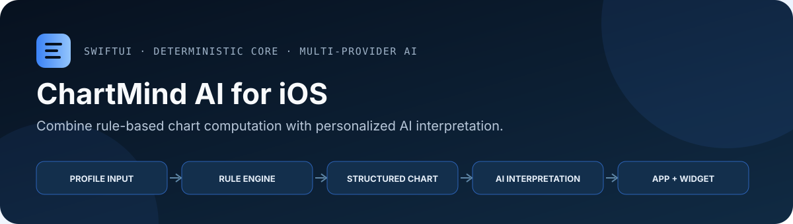
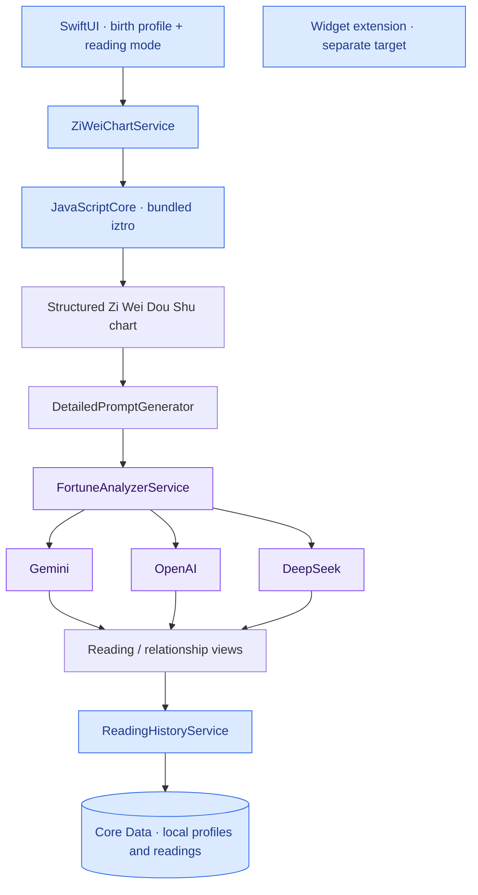

# ChartMind: Zi Wei Dou Shu for iOS

<p align="center">
  
</p>

<p align="center">
  
  
  
</p>

<p align="center">
  <a href="#build">Build</a> ·
  <a href="#architecture">Architecture</a> ·
  <a href="#review-guide">Review guide</a>
</p>

SwiftUI prototype for Zi Wei Dou Shu astrology chart calculation and AI-generated readings. It combines a deterministic rule-based chart engine with multi-provider LLM interpretation, turning structured profile inputs into personalized reading flows, relationship analysis, history views, localization, and a native iOS widget.

The product goal is to make a complex charting system usable through a modern AI interface: deterministic calculation provides the rule-based chart structure, and LLMs turn that structure into readable, personalized guidance.

## At a Glance

| Area | Implementation signal |
| --- | --- |
| Product problem | Make a complex deterministic charting system usable through a modern AI-native mobile flow. |
| Native app layer | SwiftUI onboarding, profile input, chart display, relationship analysis, history, localization, and widget surface. |
| Domain bridge | JavaScriptCore integration with a bundled rule-based chart engine. |
| AI layer | Provider abstraction across Gemini, OpenAI, and DeepSeek with structured prompt generation. |

## Product Concept

The prototype uses Zi Wei Dou Shu, a traditional rule-based charting system, as the domain engine. Because the chart itself follows deterministic rules, it cannot be treated as free-form model output. The app therefore separates deterministic computation from generative interpretation:

- Birth details are converted into a structured chart through a bundled domain engine.
- The chart, yearly-flow context, and user-selected reading mode are transformed into prompts.
- LLM providers generate personalized explanations on top of the deterministic chart output.
- Profiles and reading history are stored locally so users can revisit prior sessions.

This split keeps the core domain computation inspectable while still using LLMs where they are strongest: synthesis, explanation, and personalized narrative.

## What It Demonstrates

- Full SwiftUI product flow, including onboarding, profile input, chart display, reading generation, relationship analysis, and reading history.
- JavaScriptCore bridge from native Swift to a bundled `iztro` JavaScript engine.
- Multi-provider AI integration with Gemini, OpenAI, and DeepSeek configuration paths.
- Prompt-generation pipeline that separates system instructions from structured user/chart context.
- Core Data persistence for profiles, readings, and history-oriented workflows.
- Localization support and dedicated language-selection screens.
- iOS widget extension for a secondary surface area.
- Configuration hygiene: real API keys are kept out of git through environment variables or local `Config.xcconfig`.

## Architecture




```text
Birth profile input
  -> ZiWeiChartService
  -> JavaScriptCore bridge
  -> bundled rule-based chart engine
  -> structured chart and yearly-flow context
  -> DetailedPromptGenerator
  -> FortuneAnalyzerService
  -> Gemini / OpenAI / DeepSeek
  -> SwiftUI reading, history, and synastry views
```

The key design choice is to keep deterministic domain logic and LLM interpretation separate. That makes the app easier to debug, easier to extend to new providers, and less dependent on opaque model output for the underlying chart computation.

## Review Guide

If you are scanning this repository, the most relevant implementation areas are:

- `Features/Fortune/Services/ZiWeiChartService.swift`: native-to-JavaScriptCore bridge and deterministic chart generation.
- `Features/Fortune/Services/DetailedPromptGenerator.swift`: prompt construction from structured chart context.
- `Features/Fortune/Services/FortuneAnalyzerService.swift`: multi-provider AI integration and fallback logic.
- `CoreData/CoreDataManager.swift` and `Features/Fortune/Services/ReadingHistoryService.swift`: local persistence for profiles, readings, and in-progress tasks.
- `ziwei-widget/FortuneWidget.swift`: widget surface for a secondary iOS experience.

## Repository Structure

```text
ai-fortune-teller/
  App/                         SwiftUI app entry points and theme
  Features/Common/             shared config, services, localization, reusable views
  Features/Fortune/Models/     chart, birth profile, reading, and synastry models
  Features/Fortune/Services/   chart generation, prompt generation, AI analysis
  Features/Fortune/Views/      chart, reading, profile, and relationship flows
  CoreData/                    local persistence
  JavaScript/                  bundled iztro JavaScript runtime
ziwei-widget/                  iOS widget extension
```

## Build

Open `ai-fortune-teller.xcodeproj` in Xcode, select the `ai-fortune-teller` scheme, and build.

CLI checks used for this repo:

```bash
xcodebuild -project ai-fortune-teller.xcodeproj -scheme ai-fortune-teller -configuration Debug -destination 'generic/platform=iOS Simulator' ENABLE_ON_DEMAND_RESOURCES=NO build
xcodebuild -project ai-fortune-teller.xcodeproj -scheme ai-fortune-teller -configuration Release -destination 'generic/platform=iOS' ENABLE_ON_DEMAND_RESOURCES=NO build
```

## Local API Keys

The committed `Info.plist` uses placeholder API keys. Do not commit real keys.

For local development, set provider keys in Xcode scheme environment variables, or copy `Config.xcconfig.example` to `Config.xcconfig` and keep it local. `Config.xcconfig` is ignored by git.

Required only for live AI analysis:

```env
GEMINI_API_KEY=...
OPENAI_API_KEY=...
DEEPSEEK_API_KEY=...
```


## Extension points and limits

This is a native Zi Wei Dou Shu astrology prototype. Birth inputs produce a chart according to the bundled domain rules; deterministic computation does not validate the predictions made from that chart.

- Change chart computation in `ai-fortune-teller/Features/Fortune/Services/ZiWeiChartService.swift`.
- Change model context in `DetailedPromptGenerator.swift`.
- Add a provider through `FortuneAnalyzerService.swift` and the related configuration.
- Extend saved profiles/readings through the Core Data model and history service.

The app calls AI providers directly with local development credentials. A distributed product would need a suitable credential and backend design. The widget is a separate extension target; the diagram does not imply it shares the full reading-generation pipeline.
